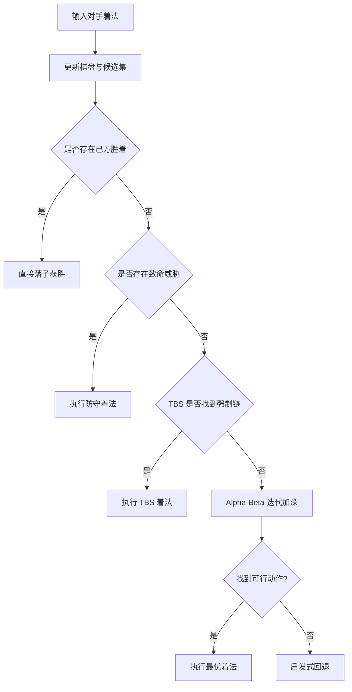

# Connect6 课程答辩版 README

本文件用于课程答辩现场讲解，目标是让评委在最短时间内理解：

- 你做了什么
- 为什么这样做
- 效果如何
- 还有哪些改进空间

---

## 1. 一句话项目定义

我们实现了一个面向 Connect6 的博弈 AI，采用“威胁优先 + 深度搜索”的混合策略：
先保证不漏防、不漏杀，再在时间预算内用 Alpha-Beta 找到质量更高的双子落点。

---

## 2. 答辩开场（30 秒）

建议开场话术：

“我们的项目是 19x19 六子棋 AI。由于每回合要落两子，分支规模远大于五子棋，暴力搜索不可行。我们采用了分层决策：先做胜着与致命威胁判断，再做威胁空间搜索（TBS）捕捉强制胜负链，最后用 Alpha-Beta 在候选空间内迭代加深。配合置换表和 Zobrist 哈希，整体在时限内实现了较稳定的对弈表现。”

---

## 3. 你要讲清楚的 4 个核心点

### 3.1 问题难点

- 棋盘大：19x19。
- 每回合双子决策，组合爆炸。
- 仅靠静态评估容易“会进攻但漏防”。

### 3.2 总体方案

- 候选生成与裁剪：只搜高价值区域。
- 威胁识别：先处理活四、冲四、双活三等战术点。
- TBS：找强制胜负链。
- Alpha-Beta：在预算内找更优着法。
- TT + Zobrist：复用已搜索局面，减少重复计算。

### 3.3 关键创新/优化（可按你们实际勾选）

- 复合威胁检测（双活三/双冲四/四三）并前置防守。
- 候选集动态扩边，降低远处漏防概率。
- PVS、Killer、History 等排序优化提高剪枝效率。
- TBS 与 Alpha-Beta 共享 TT，缩短搜索响应时间。

### 3.4 实验结果

- 与基线组或随机组进行固定局数对战。
- 展示胜率、平局率、平均用时、搜索节点数。
- 给出 1-2 个关键对局截图或棋谱片段说明“为什么赢”。

---

## 4. 架构图（答辩可直接展示）

---

## 5. 算法原理（评委追问版）

### 5.1 Alpha-Beta 的意义

在零和对弈中，极大极小搜索目标可写为：

$$
V(s) = \max_{a\in A(s)}\left(-V(T(s,a))\right)
$$

Alpha-Beta 用区间边界提前剪枝，避免遍历无用分支。

### 5.2 TBS 的意义

TBS 不追求全局最优，而是抓“强制应手链”：

- 我方层（OR）：是否存在一个威胁着法能继续保持胜势。
- 对方层（AND）：对手所有关键防守都无法阻断该胜势。

这种方法特别适合中盘战术对杀。

### 5.3 TT + Zobrist 的意义

同一局面可由不同顺序到达。用 Zobrist 构造局面哈希，将搜索结论存入 TT，可显著减少重复计算。

---

## 6. 复杂度与工程权衡

- 理论上搜索仍是指数级。
- 实战可行性来自：候选裁剪 + 剪枝 + 缓存 + 时间控制。
- 这是“最优性”与“可实时运行”之间的工程折中。

---

## 7. 实验设计模板（可直接填）

### 7.1 对局设置

- 对手集合：g06 / g07 / g08 / g09 / 随机策略
- 局数：每组对手 N 局，先后手均衡
- 时间限制：与 file.properties 一致

### 7.2 结果表（示例模板）

| 对手 | 场次 | 胜 | 平 | 负 | 胜率 | 平均步时(ms) | 平均节点数 |
|---|---:|---:|---:|---:|---:|---:|---:|
| g06 | 30 |  |  |  |  |  |  |
| g08 | 30 |  |  |  |  |  |  |
| g09 | 30 |  |  |  |  |  |  |

### 7.3 消融实验模板

| 方案 | 是否启用 TBS | 是否启用 TT | 是否候选扩边 | 胜率 |
|---|---|---|---|---:|
| Baseline | 否 | 否 | 否 |  |
| +TT | 否 | 是 | 否 |  |
| +TT+TBS | 是 | 是 | 否 |  |
| Full | 是 | 是 | 是 |  |

---

## 8. 现场演示脚本（建议）

1. 简述规则和难点（30 秒）
2. 展示决策流程图（1 分钟）
3. 展示 1 局关键对战（1-2 分钟）
4. 展示实验总表和消融结果（1 分钟）
5. 总结贡献和未来工作（30 秒）

---

## 9. 高频答辩问答（Q&A）

### Q1：为什么不用纯深度学习？

课程项目更强调可解释、可控和可复现实验；当前采用规则+搜索更稳，后续可引入学习方法做参数优化或策略网络引导。

### Q2：你们的核心提升来自哪里？

主要来自三点：威胁优先防漏、TBS 捕捉强制链、TT/排序优化提升搜索效率。

### Q3：为什么需要候选裁剪，会不会错失最优？

会有风险，但在时间受限下是必要工程折中。我们通过动态扩边、保险防守和消融实验来降低风险并验证收益。

### Q4：系统的主要瓶颈是什么？

中后盘分支增长和复杂对杀局面的深度需求。后续方向是更强的 PN/DFPN 与并行搜索。

---

## 10. 结论（答辩收尾）

我们完成了一个可运行、可解释、可评测的 Connect6 AI 系统，形成了“威胁识别 + TBS + Alpha-Beta + TT”的完整技术链路；在课程给定时间预算下，能实现稳定决策并在多组对战中体现策略优势。

可扩展方向包括：更强证明搜索、自动化参数学习、开局库与并行化。
